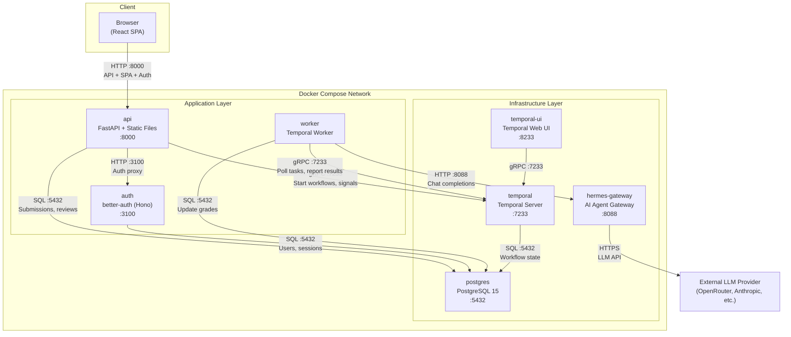
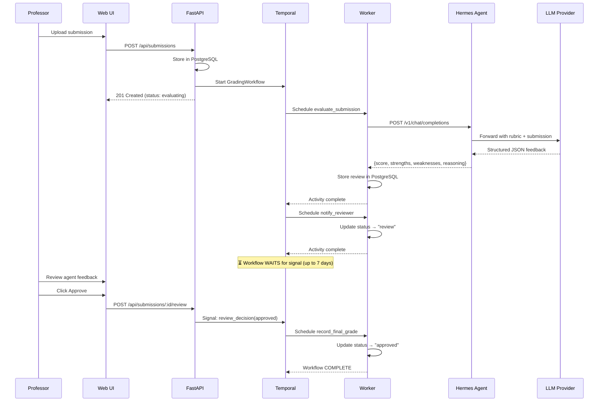

# Hermes Agent Solution Template (HAST)

A production-ready template for building AI agent workflows with durable orchestration and human-in-the-loop review. Ships with an **exam grading demo** that showcases the full pattern: AI evaluation → professor review → approval.

## Architecture



The template provides seven Docker containers orchestrated via Docker Compose. This is the core infrastructure you get out of the box -- swap the demo-specific pieces for your own domain logic:

| Container | Role | Port |
|-----------|------|------|
| **postgres** | PostgreSQL 15 — data storage, auth, workflow state | 5432 |
| **temporal** | Temporal Server — durable workflow orchestration | 7233 |
| **temporal-ui** | Temporal Web UI — workflow visibility | 8233 |
| **hermes-gateway** | Hermes AI Agent — LLM calls via OpenAI-compatible API | 8088 |
| **auth** | better-auth — email/password + OAuth authentication | 3100 |
| **api** | FastAPI backend + React frontend (SPA) | 8000 |
| **worker** | Temporal worker — executes workflow activities | — |

## Use Cases

This template implements a generic **AI evaluate → human review → approve/reject** pattern. The included grading demo is one example. You could fork this template to build:

- **Document review** — AI summarizes and flags issues in contracts, proposals, or reports; reviewers approve or request revisions
- **Code review** — AI analyzes pull requests or code submissions against style guides and best practices; senior engineers review
- **Content moderation** — AI flags user-generated content; moderators make final decisions
- **Application screening** — AI evaluates job applications or grant proposals against criteria; hiring managers review shortlisted candidates
- **Medical report analysis** — AI extracts findings from lab results or imaging reports; physicians confirm or annotate

Each of these follows the same workflow pattern: submit content → AI evaluates against configurable criteria → human reviews AI output → approve, reject, or request re-evaluation.

## Demo: Exam Grading Workflow

The included demo implements an exam grading use case to showcase the full template pattern. Professors upload student submissions, the Hermes AI agent evaluates them against a configurable rubric, and professors review and finalize grades.



The workflow is durable -- if the server crashes during grading, it resumes exactly where it left off. LLM calls use heartbeats for crash detection, idempotent writes prevent duplicates on retry, and rate limits are respected automatically.

## Quick Start

```bash
# 1. Clone and enter the project
cd hermes-agent-solution-template

# 2. Create your local environment file
cp infra/local/.env.example infra/shared/.env

# 3. Edit .env with your API keys
#    At minimum, set LLM_API_KEY and HERMES_API_KEY

# 4. Start all services
docker compose -f infra/shared/docker-compose.yml \
               -f infra/local/docker-compose.override.yml \
               up --build

# 5. Open the application
#    Web UI:       http://localhost:8000
#    Temporal UI:  http://localhost:8233
#    Auth (proxied): http://localhost:8000/api/auth
```

## Test Credentials (Local Development)

On first run, sign up using the web UI at `http://localhost:8000/login`. For consistent testing:

| Field | Value |
|-------|-------|
| **Email** | `prof@test.edu` |
| **Password** | `TestPassword123!` |
| **Name** | `Professor Test` |

Click "Sign up" on first use, then "Sign in" on subsequent runs.

> **Note:** In dev mode (no `AUTH_SECRET` set), the backend bypasses authentication entirely. The frontend still requires sign-in via the auth service.

## Authentication

The template uses [better-auth](https://better-auth.com) for self-hosted authentication. Three sign-in methods are supported:

- **Email + Password** -- always available
- **Google OAuth** -- requires `GOOGLE_CLIENT_ID` and `GOOGLE_CLIENT_SECRET` in `.env`
- **GitHub OAuth** -- requires `GITHUB_CLIENT_ID` and `GITHUB_CLIENT_SECRET` in `.env`

OAuth providers are optional. If their env vars are empty, the buttons appear but won't work. See [Google Cloud Console](https://console.cloud.google.com/apis/credentials) and [GitHub Developer Settings](https://github.com/settings/developers) to create OAuth apps.

## Configuration

All configuration is managed through environment variables. Copy `infra/local/.env.example` to `infra/shared/.env` and fill in required values.

| Variable | Description | Default |
|---|---|---|
| `HERMES_MODEL_PROVIDER` | LLM provider for Hermes agent | `openrouter` |
| `LLM_API_KEY` | LLM provider API key (OpenRouter, OpenCode Go, etc.) | required |
| `HERMES_API_KEY` | Self-assigned key for Hermes gateway auth | required |
| `AUTH_SECRET` | Random string for signing auth sessions | required in production |
| `AUTH_SERVICE_URL` | Internal URL of the better-auth service (API proxy) | `http://auth:3100` |
| `GOOGLE_CLIENT_ID` | Google OAuth client ID | optional |
| `GOOGLE_CLIENT_SECRET` | Google OAuth client secret | optional |
| `GITHUB_CLIENT_ID` | GitHub OAuth app client ID | optional |
| `GITHUB_CLIENT_SECRET` | GitHub OAuth app client secret | optional |
| `TASK_QUEUE` | Temporal task queue name | `grading-queue` |
| `GRADING_TIMEOUT_DAYS` | Days before unreviewed submissions expire | `7` |

## Documentation

See the [`docs/`](docs/) directory for detailed guides:

| Document | Description |
|----------|-------------|
| [Architecture](docs/ARCHITECTURE.md) | System design, container diagram, communication patterns, security model |
| [API Reference](docs/API.md) | REST endpoint reference for the included grading demo |
| [Deployment](docs/DEPLOYMENT.md) | Local dev, Docker Compose, production (Hetzner/Lightsail), SSL |
| [Workflows](docs/WORKFLOWS.md) | Temporal workflow engine, signals, human-in-the-loop pattern |
| [Customization](docs/CUSTOMIZATION.md) | How to fork the template and build your own use case |
| [Data Model](docs/DATA_MODEL.md) | ER diagram, all tables, indexes, migration strategy |

## Development

### Project Structure

```
hermes-agent-solution-template/
├── frontend/                  # React SPA (Vite + TanStack + shadcn/ui)
├── services/
│   ├── api/                   # FastAPI application
│   ├── auth/                  # better-auth service (Hono + Node.js)
│   ├── workers/               # Temporal worker processes
│   └── hermes/                # Hermes agent config + Dockerfile
├── infra/
│   ├── shared/                # Base Docker Compose + SQL init
│   ├── local/                 # Local dev overrides
│   └── hetzner/               # Production deployment
├── src/edu_agent_platform/    # Shared Python package
├── docs/                      # Documentation
├── tests/                     # Test suite
├── scripts/                   # Utility scripts
└── sample_data/               # Sample submissions for testing
```

### Running Tests

```bash
PYTHONPATH=.:src pytest tests/ -v
```

### Frontend Development

```bash
cd frontend && pnpm install && pnpm dev
```

The Vite dev server proxies API calls to the FastAPI backend at `:8000`.

### Database

The database schema is initialized automatically by `infra/shared/init-db.sql` when the postgres container starts for the first time. To reset the database, remove the `postgres_data` volume:

```bash
docker compose -f infra/shared/docker-compose.yml down -v
```
