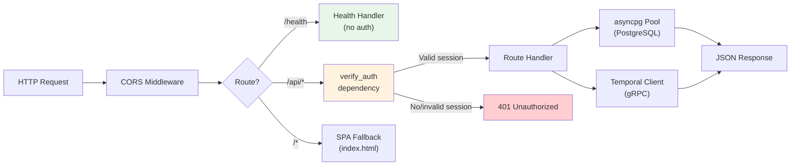

# API Reference

> Complete reference for the Hermes Agent Solution Template (HAST) REST API.

> **Note:** This API reference covers the included grading demo. When building your own use case, you'll add domain-specific endpoints following the same patterns (Pydantic schemas, asyncpg queries, Temporal workflow integration). See [Customization](./CUSTOMIZATION.md) for a step-by-step guide.

## Table of Contents

- [Overview](#overview)
- [Authentication](#authentication)
- [Request Flow](#request-flow)
- [Error Format](#error-format)
- [Endpoints](#endpoints)
  - [Health](#health)
  - [Submissions](#submissions)
  - [Reviews](#reviews)
  - [Settings](#settings)
  - [Provider Configuration](#provider-configuration)
  - [Stats](#stats)
- [See Also](#see-also)

---

## Overview

**Base URL:** `http://localhost:8000` (local development)

The API is served by FastAPI on port 8000. All endpoints under `/api/*` require authentication. The `/health` endpoint is public. The API also serves the React SPA for any non-API routes (SPA fallback).

**Content Types:**
- Most endpoints accept and return `application/json`
- `POST /api/submissions` accepts `multipart/form-data` (for file uploads)

**Source files:**
- `services/api/main.py` -- Application entrypoint and route registration
- `services/api/routes/` -- Route modules (submissions, reviews, settings, stats)
- `services/api/schemas.py` -- Pydantic request/response models
- `services/api/auth.py` -- Authentication dependency
- `services/api/deps.py` -- Database pool and Temporal client singletons

---

## Authentication

All `/api/*` routes require a valid session. Two methods are supported:

### Cookie Authentication

The browser automatically sends the `better-auth.session_token` cookie after signing in through the auth service at `:3100`.

```bash
# The cookie is set automatically by the auth service.
# For curl testing, first sign in and capture the cookie:
curl -c cookies.txt -X POST http://localhost:3100/api/auth/sign-in/email \
  -H "Content-Type: application/json" \
  -d '{"email": "prof@test.edu", "password": "TestPassword123!"}'

# Then use the cookie for API requests:
curl -b cookies.txt http://localhost:8000/api/submissions
```

### Bearer Token Authentication

Pass the session token in the `Authorization` header:

```bash
curl http://localhost:8000/api/submissions \
  -H "Authorization: Bearer <session-token>"
```

### Dev Mode

When `AUTH_SECRET` is not set (local development default), authentication is bypassed entirely on the backend. All requests are treated as coming from a dev user (`dev@localhost`). The frontend still requires sign-in through the auth service.

### Authentication Verification

The `verify_auth` dependency in `services/api/auth.py` performs a direct SQL query:

```sql
SELECT s.*, u.email, u.name
FROM session s
JOIN "user" u ON s."userId" = u.id
WHERE s.token = $1 AND s."expiresAt" > NOW()
```

On success, returns `{"sub": "<userId>", "email": "<email>", "name": "<name>"}`.

---

## Request Flow



---

## Error Format

All error responses follow this structure:

```json
{
  "detail": "Human-readable error message"
}
```

Common status codes:

| Code | Meaning |
|---|---|
| `400` | Bad request (validation error, missing fields) |
| `401` | Not authenticated (missing or invalid session) |
| `404` | Resource not found |
| `409` | Conflict (e.g., no active workflow for submission) |
| `422` | Validation error (Pydantic/FastAPI automatic) |
| `502` | Bad gateway (failed to signal Temporal workflow) |

FastAPI validation errors (422) have a more detailed format:

```json
{
  "detail": [
    {
      "loc": ["body", "title"],
      "msg": "field required",
      "type": "value_error.missing"
    }
  ]
}
```

---

## Endpoints

### Health

#### `GET /health`

Public health check endpoint. No authentication required.

**Response:** `200 OK`
```json
{
  "status": "ok"
}
```

**Example:**
```bash
curl http://localhost:8000/health
```

---

### Submissions

Source: `services/api/routes/submissions.py`

#### `POST /api/submissions`

Upload a new submission and start the grading workflow.

**Content-Type:** `multipart/form-data`

**Form Fields:**

| Field | Type | Required | Description |
|---|---|---|---|
| `title` | string | Yes | Title of the submission |
| `student_name` | string | Yes | Name of the student |
| `content` | string | No | Text content of the submission |
| `file` | file | No | Uploaded file (decoded as UTF-8) |

At least one of `content` or `file` must be provided.

**Response:** `201 Created`
```json
{
  "id": "a1b2c3d4-...",
  "title": "Midterm Exam - Essay Question 3",
  "student_name": "Jane Smith",
  "status": "evaluating",
  "created_at": "2026-03-26T10:30:00Z",
  "workflow_id": "grading-a1b2c3d4-..."
}
```

**Errors:**
- `400` -- Neither `content` nor `file` provided
- `401` -- Not authenticated

**Example:**
```bash
# With text content
curl -X POST http://localhost:8000/api/submissions \
  -H "Authorization: Bearer <token>" \
  -F "title=Midterm Essay Q3" \
  -F "student_name=Jane Smith" \
  -F "content=The Industrial Revolution began in Britain..."

# With file upload
curl -X POST http://localhost:8000/api/submissions \
  -H "Authorization: Bearer <token>" \
  -F "title=Final Exam" \
  -F "student_name=John Doe" \
  -F "file=@submission.txt"
```

**Side effects:**
1. Inserts a row into `submissions` with `status='pending'`
2. Reads the rubric from `app_settings`
3. Starts a `GradingWorkflow` Temporal workflow on the `grading-queue` task queue
4. Updates the submission to `status='evaluating'` with the `workflow_id`

---

#### `GET /api/submissions`

List all submissions with pagination.

**Query Parameters:**

| Parameter | Type | Default | Constraints | Description |
|---|---|---|---|---|
| `offset` | int | `0` | >= 0 | Number of records to skip |
| `limit` | int | `20` | 1-100 | Maximum records to return |

**Response:** `200 OK`
```json
{
  "submissions": [
    {
      "id": "a1b2c3d4-...",
      "title": "Midterm Essay Q3",
      "student_name": "Jane Smith",
      "status": "review",
      "created_at": "2026-03-26T10:30:00Z",
      "workflow_id": "grading-a1b2c3d4-..."
    }
  ],
  "total": 42
}
```

**Example:**
```bash
curl "http://localhost:8000/api/submissions?offset=0&limit=10" \
  -H "Authorization: Bearer <token>"
```

---

#### `GET /api/submissions/{submission_id}`

Get a single submission with its latest review.

**Path Parameters:**

| Parameter | Type | Description |
|---|---|---|
| `submission_id` | UUID | Submission ID |

**Response:** `200 OK`
```json
{
  "id": "a1b2c3d4-...",
  "title": "Midterm Essay Q3",
  "student_name": "Jane Smith",
  "content": "The Industrial Revolution began in Britain...",
  "status": "review",
  "created_at": "2026-03-26T10:30:00Z",
  "workflow_id": "grading-a1b2c3d4-...",
  "latest_review": {
    "id": "e5f6g7h8-...",
    "submission_id": "a1b2c3d4-...",
    "agent_feedback": {
      "suggested_score": 82.5,
      "strengths": ["Clear thesis statement", "Good use of primary sources"],
      "weaknesses": ["Missing conclusion paragraph", "Some factual inaccuracies"],
      "reasoning": "The submission demonstrates a solid understanding of..."
    },
    "suggested_score": 82.5,
    "final_score": null,
    "professor_notes": null,
    "decision": "pending_review",
    "created_at": "2026-03-26T10:31:00Z",
    "updated_at": "2026-03-26T10:31:00Z"
  }
}
```

**Errors:**
- `404` -- Submission not found

**Example:**
```bash
curl http://localhost:8000/api/submissions/a1b2c3d4-... \
  -H "Authorization: Bearer <token>"
```

---

### Reviews

Source: `services/api/routes/reviews.py`

#### `GET /api/submissions/{submission_id}/reviews`

List all reviews for a submission (evaluation history, ordered newest first).

**Response:** `200 OK`
```json
[
  {
    "id": "e5f6g7h8-...",
    "submission_id": "a1b2c3d4-...",
    "agent_feedback": { ... },
    "suggested_score": 82.5,
    "final_score": 85.0,
    "professor_notes": "Good work, bumped score slightly for effort.",
    "decision": "approved",
    "created_at": "2026-03-26T10:31:00Z",
    "updated_at": "2026-03-26T11:00:00Z"
  }
]
```

**Errors:**
- `404` -- Submission not found

**Example:**
```bash
curl http://localhost:8000/api/submissions/a1b2c3d4-.../reviews \
  -H "Authorization: Bearer <token>"
```

---

#### `POST /api/submissions/{submission_id}/review`

Submit a professor's review decision and signal the Temporal workflow.

**Request Body:**
```json
{
  "decision": "approve",
  "final_score": 85.0,
  "notes": "Good analysis, minor score adjustment."
}
```

| Field | Type | Required | Description |
|---|---|---|---|
| `decision` | string | Yes | One of: `"approve"`, `"reject"`, `"re_evaluate"` |
| `final_score` | float | No | Override score (0-100). If null, the agent's suggested score is used. |
| `notes` | string | No | Professor notes (max 2000 characters) |

**Response:** `201 Created`
```json
{
  "id": "i9j0k1l2-...",
  "submission_id": "a1b2c3d4-...",
  "agent_feedback": {},
  "suggested_score": null,
  "final_score": 85.0,
  "professor_notes": "Good analysis, minor score adjustment.",
  "decision": "approved",
  "created_at": "2026-03-26T11:00:00Z",
  "updated_at": null
}
```

**Errors:**
- `404` -- Submission not found
- `409` -- No active workflow for this submission
- `502` -- Failed to signal the Temporal workflow

**Decision mapping:**

| API Decision | DB Value | Workflow Signal | Submission Status |
|---|---|---|---|
| `approve` | `approved` | `approved` | `approved` |
| `reject` | `rejected` | `rejected` | `rejected` |
| `re_evaluate` | `re_evaluate` | `re-evaluate` | `evaluating` |

**Side effects:**
1. Inserts a review record in the `reviews` table
2. Signals the Temporal workflow with the decision
3. Updates the submission status

**Example:**
```bash
# Approve with score override
curl -X POST http://localhost:8000/api/submissions/a1b2c3d4-.../review \
  -H "Authorization: Bearer <token>" \
  -H "Content-Type: application/json" \
  -d '{"decision": "approve", "final_score": 85.0, "notes": "Good work."}'

# Request re-evaluation with feedback
curl -X POST http://localhost:8000/api/submissions/a1b2c3d4-.../review \
  -H "Authorization: Bearer <token>" \
  -H "Content-Type: application/json" \
  -d '{"decision": "re_evaluate", "notes": "Please weigh critical thinking more heavily."}'

# Reject
curl -X POST http://localhost:8000/api/submissions/a1b2c3d4-.../review \
  -H "Authorization: Bearer <token>" \
  -H "Content-Type: application/json" \
  -d '{"decision": "reject", "notes": "Suspected academic dishonesty."}'
```

---

### Settings

Source: `services/api/routes/settings.py`

#### `GET /api/settings`

Return all application settings. API key settings (`hermes_api_key`) are excluded from this listing.

**Response:** `200 OK`
```json
[
  {
    "key": "rubric",
    "value": "{\"name\": \"Default Grading Rubric\", \"max_score\": 100, ...}"
  },
  {
    "key": "grading_instructions",
    "value": ""
  },
  {
    "key": "max_score",
    "value": "100"
  },
  {
    "key": "hermes_model",
    "value": "glm-5"
  }
]
```

**Example:**
```bash
curl http://localhost:8000/api/settings \
  -H "Authorization: Bearer <token>"
```

---

#### `PUT /api/settings/{key}`

Create or update a single setting by key. Cannot be used for provider configuration keys (`hermes_provider`, `hermes_model`, `hermes_api_key`) -- use the `/api/settings/provider` endpoint instead.

**Request Body:**
```json
{
  "key": "rubric",
  "value": "{\"name\": \"Custom Rubric\", \"max_score\": 100, \"criteria\": [...]}"
}
```

| Field | Type | Required | Constraints |
|---|---|---|---|
| `key` | string | Yes | Must match URL parameter, 1-100 chars |
| `value` | string | Yes | Max 2000 chars |

**Response:** `200 OK`
```json
{
  "key": "rubric",
  "value": "{\"name\": \"Custom Rubric\", ...}"
}
```

**Errors:**
- `400` -- Key in URL does not match key in body
- `400` -- Attempted to write a provider config key via this endpoint

**Example:**
```bash
curl -X PUT http://localhost:8000/api/settings/rubric \
  -H "Authorization: Bearer <token>" \
  -H "Content-Type: application/json" \
  -d '{"key": "rubric", "value": "{\"name\": \"Updated Rubric\", \"max_score\": 100, \"criteria\": []}"}'
```

---

### Provider Configuration

Source: `services/api/routes/settings.py`

#### `GET /api/settings/provider`

Return the current LLM provider configuration. The API key is never returned in full -- only whether one is set and a masked hint showing the last 4 characters.

**Response:** `200 OK`
```json
{
  "provider": "openrouter",
  "model": "glm-5",
  "api_key_set": true,
  "api_key_hint": "****ab12"
}
```

**Example:**
```bash
curl http://localhost:8000/api/settings/provider \
  -H "Authorization: Bearer <token>"
```

---

#### `PUT /api/settings/provider`

Update the LLM provider, model, and optionally the API key.

**Request Body:**
```json
{
  "provider": "openrouter",
  "model": "anthropic/claude-3-haiku",
  "api_key": "sk-or-..."
}
```

| Field | Type | Required | Constraints | Description |
|---|---|---|---|---|
| `provider` | string | Yes | Must be `"openrouter"` or `"opencode-go"` | LLM provider identifier |
| `model` | string | Yes | 1-200 chars | Model name/ID |
| `api_key` | string | No | Max 500 chars | API key. If empty string, existing key is preserved. |

**Response:** `200 OK`
```json
{
  "provider": "openrouter",
  "model": "anthropic/claude-3-haiku",
  "api_key_set": true,
  "api_key_hint": "****or-5"
}
```

**Errors:**
- `400` -- Provider not in allowed list (`openrouter`, `opencode-go`)

**Example:**
```bash
# Update provider and model (keep existing API key)
curl -X PUT http://localhost:8000/api/settings/provider \
  -H "Authorization: Bearer <token>" \
  -H "Content-Type: application/json" \
  -d '{"provider": "openrouter", "model": "anthropic/claude-3-haiku", "api_key": ""}'

# Update everything including API key
curl -X PUT http://localhost:8000/api/settings/provider \
  -H "Authorization: Bearer <token>" \
  -H "Content-Type: application/json" \
  -d '{"provider": "opencode-go", "model": "glm-5", "api_key": "sk-new-key-here"}'
```

---

### Stats

Source: `services/api/routes/stats.py`

#### `GET /api/stats`

Return aggregate dashboard statistics.

**Response:** `200 OK`
```json
{
  "total_submissions": 42,
  "pending_reviews": 5,
  "approved_count": 30,
  "average_score": 78.35,
  "agent_agreement_rate": 0.7333
}
```

| Field | Type | Description |
|---|---|---|
| `total_submissions` | int | Total number of submissions |
| `pending_reviews` | int | Submissions with status `pending`, `evaluating`, or `review` |
| `approved_count` | int | Submissions with status `approved` |
| `average_score` | float or null | Average `final_score` across all reviews with a final score |
| `agent_agreement_rate` | float or null | Proportion of reviews where `final_score == suggested_score` (professor accepted AI score as-is) |

**Example:**
```bash
curl http://localhost:8000/api/stats \
  -H "Authorization: Bearer <token>"
```

---

## See Also

- [Architecture](./ARCHITECTURE.md) -- System overview and design decisions
- [Deployment Guide](./DEPLOYMENT.md) -- How to run the template
- [Data Model](./DATA_MODEL.md) -- Database schema reference
- [Workflows](./WORKFLOWS.md) -- Temporal workflow details
