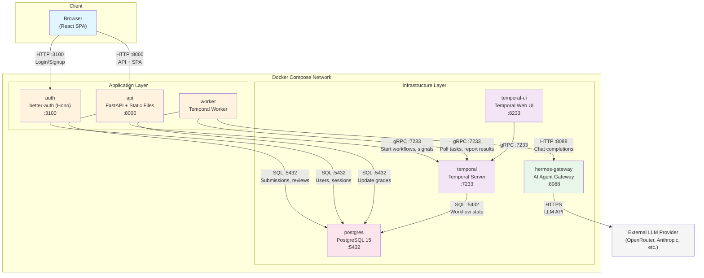
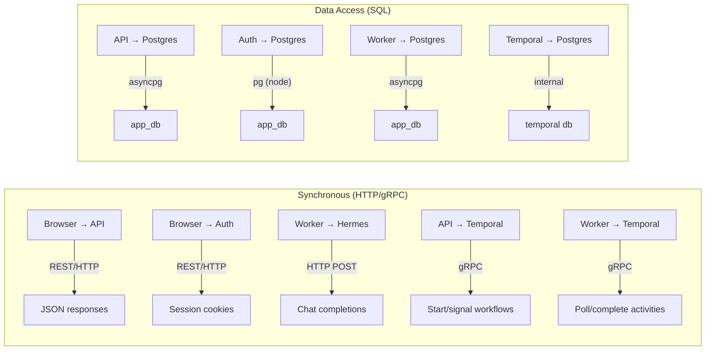
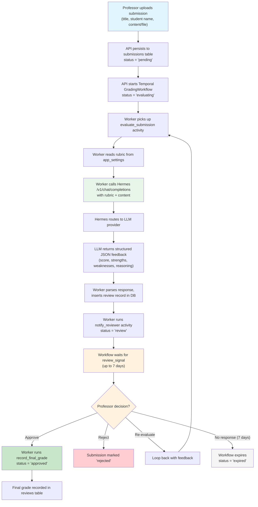
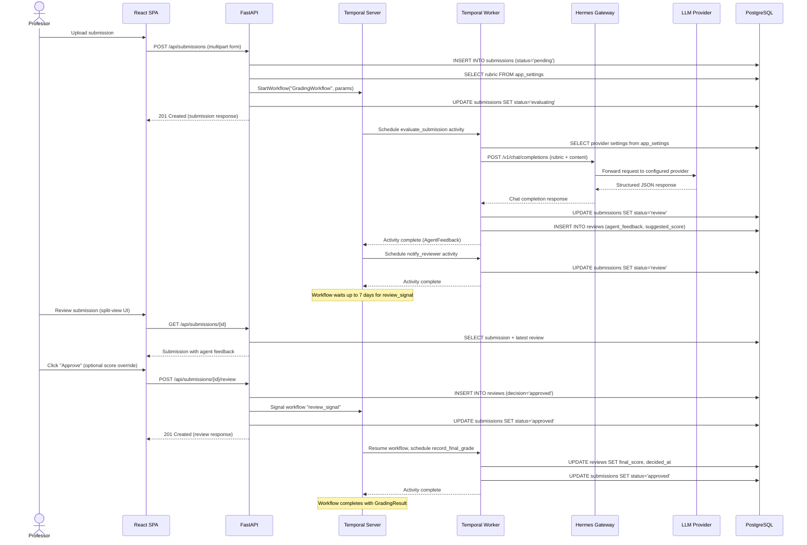
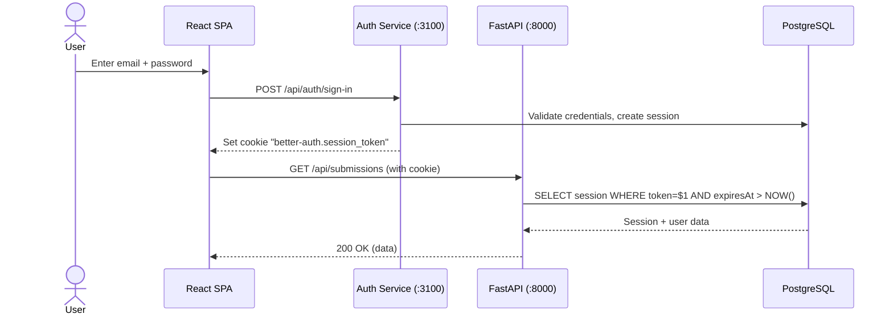

# Architecture

> High-level architecture of the Hermes Agent Solution Template (HAST) -- a production-ready template for building AI agent workflows with durable orchestration and human-in-the-loop review.

## Table of Contents

- [System Overview](#system-overview)
- [Architecture Diagram](#architecture-diagram)
- [Container Responsibilities](#container-responsibilities)
- [Communication Patterns](#communication-patterns)
- [Data Flow](#data-flow)
- [Demo: Grading Workflow Sequence](#demo-grading-workflow-sequence)
- [Technology Choices](#technology-choices)
- [Security Model](#security-model)
- [Scalability Considerations](#scalability-considerations)
- [See Also](#see-also)

---

## System Overview

The Hermes Agent Solution Template (HAST) is composed of **seven Docker containers** that together provide the infrastructure for AI agent workflows with human-in-the-loop review. The template ships with an exam grading demo: professors upload student submissions through a React frontend, a Temporal workflow orchestrates the evaluation pipeline, the Hermes AI agent evaluates submissions against a configurable rubric, and professors review the AI's suggested grades in a split-view UI before approving, rejecting, or requesting re-evaluation.

The grading demo showcases the template's core pattern -- **AI evaluate → human review → approve/reject** -- which generalizes to any domain (document review, code review, content moderation, etc.).

The template follows a **microservices architecture** with clear separation of concerns:

- **Frontend + API** are bundled into a single container (FastAPI serves the built React SPA)
- **Orchestration** is handled by Temporal for durable, retryable workflows
- **AI evaluation** is isolated behind the Hermes Agent Gateway
- **Authentication** is a standalone better-auth service
- **Data** lives in a single PostgreSQL instance with two logical databases

---

## Architecture Diagram

---

## Container Responsibilities

| Container | Image / Build | Port | Purpose |
|---|---|---|---|
| **postgres** | `postgres:15` | `127.0.0.1:5432` | Single PostgreSQL instance hosting two databases: `temporal` (workflow state) and `app_db` (submissions, reviews, settings, auth tables). Initialized by `infra/shared/init-db.sql`. |
| **temporal** | `temporalio/auto-setup:1.24.2` | `127.0.0.1:7233` | Temporal Server for durable workflow orchestration. Auto-creates its own `temporal` database on first boot. Provides gRPC API for workflow management. |
| **temporal-ui** | `temporalio/ui:2.27.0` | `127.0.0.1:8233` | Web dashboard for inspecting workflows, viewing execution history, and debugging. Read-only visibility into the Temporal server. |
| **hermes-gateway** | Custom build (`services/hermes/Dockerfile`) | `127.0.0.1:8088` | Hermes Agent Gateway exposing an OpenAI-compatible `/v1/chat/completions` endpoint. Routes requests to the configured LLM provider (OpenRouter, Anthropic, etc.). Personality defined in `SOUL.md`. In the demo, this is configured as a grading agent; customize SOUL.md for your domain. |
| **auth** | Custom build (`services/auth/Dockerfile`) | `127.0.0.1:3100` | Standalone better-auth service (Hono + Node.js). Handles email+password signup/login, Google OAuth, and GitHub OAuth. Manages user, session, account, and verification tables. |
| **api** | Custom build (`services/api/Dockerfile`) | `127.0.0.1:8000` | FastAPI backend serving the React SPA (static files) and all `/api/*` endpoints. Connects to Postgres for data and Temporal for workflow management. All `/api` routes require authentication. |
| **worker** | Custom build (`services/workers/Dockerfile`) | None (internal) | Temporal worker process that polls the task queue and executes workflow activities. In the demo, it runs grading activities: calls Hermes for AI evaluation, updates Postgres with results, records final grades. |

---

## Communication Patterns

### Protocol Summary

| From | To | Protocol | Purpose |
|---|---|---|---|
| Browser | API (`:8000`) | HTTP REST | SPA assets, submission CRUD, review decisions, settings, stats |
| Browser | Auth (`:3100`) | HTTP REST | Sign up, sign in, session management, OAuth callbacks |
| API | Temporal (`:7233`) | gRPC | Start grading workflows, send review signals |
| API | Postgres (`:5432`) | TCP (asyncpg) | Read/write submissions, reviews, settings |
| Worker | Temporal (`:7233`) | gRPC | Poll task queue, report activity results |
| Worker | Hermes (`:8088`) | HTTP POST | Send rubric + submission for AI evaluation |
| Worker | Postgres (`:5432`) | TCP (asyncpg) | Update submission status, insert review records |
| Auth | Postgres (`:5432`) | TCP (pg) | Manage user, session, account tables |
| Temporal | Postgres (`:5432`) | TCP (internal) | Persist workflow execution state |
| Hermes | External LLM | HTTPS | Forward inference requests to OpenRouter/Anthropic/etc. |

---

## Data Flow

The following diagram shows the complete lifecycle of a submission from upload through grading to final approval.

---

## Demo: Grading Workflow Sequence

---

## Technology Choices

### Why Temporal?

**Problem:** Human-in-the-loop workflows are long-running (the demo waits up to 7 days for professor review) and must survive server restarts, network failures, and container re-deployments.

**Why Temporal solves this:**
- **Durability:** Workflow state is persisted to Postgres. If the worker crashes mid-evaluation, it resumes exactly where it left off after restart.
- **Signals:** The `review_signal` mechanism lets the API inject a professor's decision into a waiting workflow without polling or complex state management.
- **Retry policies:** The `evaluate_submission` activity has automatic retries (3 attempts, exponential backoff from 10s to 60s) if the LLM call fails.
- **Timeouts:** The 7-day review timeout is a first-class Temporal feature -- no cron jobs or schedulers needed.
- **Visibility:** The Temporal UI (`:8233`) provides full execution history for debugging.

### Why Hermes Agent Gateway?

**Problem:** The template needs to call different LLM providers (OpenRouter, Anthropic, etc.) with a consistent interface and configurable persona.

**Why Hermes solves this:**
- **OpenAI-compatible API:** Exposes a standard `/v1/chat/completions` endpoint, so the worker code doesn't need provider-specific logic.
- **Provider abstraction:** Switch LLM providers by changing `HERMES_MODEL_PROVIDER` -- no code changes.
- **SOUL.md personality:** The agent's behavior (grading principles, response format, constraints) is defined in a markdown file, not hardcoded.
- **Self-hosted:** Runs as a Docker container with its own API key authentication.

### Why better-auth?

**Problem:** Need self-hosted authentication with email+password and OAuth support without vendor lock-in.

**Why better-auth solves this:**
- **Self-hosted:** All auth data stays in the template's own Postgres database.
- **Multiple providers:** Email+password always available; Google and GitHub OAuth configurable via env vars.
- **Session-based:** Uses database-backed sessions with cookies and Bearer tokens.
- **Lightweight:** Runs as a small Hono (Node.js) server on port 3100.
- **React integration:** `@better-auth/react` provides `useSession()` and auth client hooks.

### Why FastAPI + React?

- **FastAPI:** Async-native Python with Pydantic validation, OpenAPI docs, and excellent asyncpg/Temporal SDK support.
- **React (Vite + TanStack):** Modern SPA with file-based routing (TanStack Router), server-state management (TanStack Query), and the shadcn/ui component library.
- **Bundled deployment:** The Vite build output is served by FastAPI as static files, eliminating the need for a separate frontend container or nginx.

---

## Security Model

### Authentication Flow

### Key Security Properties

| Aspect | Implementation |
|---|---|
| **Session verification** | FastAPI reads `better-auth.session_token` cookie or `Authorization: Bearer <token>` header. Validates directly against the `session` table joined with `user`. |
| **Dev mode bypass** | When `AUTH_SECRET` is not set, `verify_auth()` returns a dev user (`dev@localhost`). This is intentional for local development. The frontend still requires sign-in through the auth service. |
| **API key protection** | Hermes API key is never returned in full. The `/api/settings/provider` endpoint returns only `api_key_set: bool` and `api_key_hint: "****last4"`. Direct writes to provider key settings via `/api/settings/{key}` are blocked. |
| **Port binding** | All Docker ports are bound to `127.0.0.1` only (e.g., `127.0.0.1:8000:8000`), preventing external access without a reverse proxy. |
| **CORS** | Configured for `localhost:5173` (Vite dev), `localhost:8000` (Docker), plus any `CORS_ORIGINS` env var entries. Production adds `https://{SITE_DOMAIN}`. |
| **SQL injection** | All database queries use parameterized queries via asyncpg (`$1`, `$2`, etc.). No string interpolation in SQL. |
| **OAuth** | Google and GitHub OAuth are optional. If env vars are empty, the provider is disabled in better-auth. Callback URLs must be configured in the respective developer consoles. |

---

## Scalability Considerations

| Component | Current Design | Scaling Path |
|---|---|---|
| **API** | Single container | Horizontal: run multiple API containers behind a load balancer. Session validation is stateless (DB lookup). |
| **Worker** | Single container | Horizontal: run multiple worker containers. Temporal distributes activities across workers automatically. |
| **Postgres** | Single instance, two databases | Vertical: increase resources. For high scale, separate Temporal DB from app DB onto different instances. |
| **Hermes** | Single container | Horizontal: run multiple Hermes instances behind a load balancer. Each is stateless. |
| **Temporal** | Single server (auto-setup) | Production: deploy Temporal cluster with separate history, matching, and frontend services. |
| **Auth** | Single container | Horizontal: stateless (DB-backed sessions). Run multiple behind a load balancer. |
| **File uploads** | Docker volume (`upload_data`) | Move to S3/MinIO for multi-node deployments. |

---

## Temporal Activity Design

The Temporal activities in this template follow AI agent best practices for reliability and efficiency. This section explains the key design decisions.

### Why activities are split (LLM call vs DB write)

The `evaluate_submission` activity (LLM call) and `persist_review` activity (DB write) are separate activities rather than a single combined operation. This matters because:

- **LLM calls are expensive and slow.** If a single activity performed both the LLM call and the DB write, a crash after the LLM response but before the DB commit would require re-running the entire LLM inference on retry. With separate activities, only the cheap DB write is retried.
- **Different retry characteristics.** LLM calls may fail due to rate limits or provider outages (retryable with backoff). DB writes may fail due to connection issues (retryable quickly). Separating them allows each activity to have its own retry policy tuned to its failure mode.
- **Idempotency is easier to guarantee.** The DB write activity uses deterministic review IDs and ON CONFLICT upserts, making it safe to retry. The LLM call activity is inherently non-idempotent (each call may produce different output), so minimizing unnecessary re-calls is important.

### Heartbeat pattern for long-running LLM calls

LLM inference can take 30-60 seconds. Without heartbeats, Temporal cannot distinguish between "the activity is still running" and "the worker crashed." The `evaluate_submission` activity sends heartbeats every 10 seconds while waiting for the LLM response.

This enables a `heartbeat_timeout` of 30 seconds -- if three consecutive heartbeats are missed, Temporal assumes the worker is dead and reschedules the activity. Without heartbeats, crash detection would depend on the full `start_to_close_timeout` (2 minutes), leaving the workflow stalled for much longer.

### Error classification for retry correctness

Not all errors should be retried. The activities classify HTTP errors into two categories:

| Error Type | HTTP Status | Retryable? | Rationale |
|---|---|---|---|
| Rate limit | 429 | Yes | Provider is temporarily overloaded; respect `Retry-After` header |
| Server error | 5xx | Yes | Transient infrastructure failure; likely to resolve on retry |
| Client error | 4xx (not 429) | No | Bad request, auth failure, or invalid input; retrying will not help |

Client errors are raised as `ApplicationError(non_retryable=True)`, which tells Temporal to fail the activity immediately without consuming remaining retry attempts. This prevents wasting time and API quota on requests that will never succeed.

### Data passing strategy (DB reference vs payload)

Activities receive `submission_id` rather than the full submission content. The activity fetches the content from PostgreSQL at execution time. This design choice has three benefits:

1. **Small event history.** Temporal persists every activity input in its event history. Passing a UUID (36 bytes) instead of a full essay (potentially hundreds of KB) keeps the history compact and fast to replay.
2. **Avoids payload limits.** Temporal has a default 2MB payload limit. Large submissions or file attachments could exceed this if passed directly.
3. **Fresh data.** If submission content is updated between retries (unlikely but possible), the activity always reads the latest version from the database.

---

## See Also

- [API Reference](./API.md) -- Complete endpoint documentation
- [Deployment Guide](./DEPLOYMENT.md) -- Local and production setup
- [Workflows](./WORKFLOWS.md) -- Temporal workflow deep dive
- [Data Model](./DATA_MODEL.md) -- Database schema reference
- [Customization](./CUSTOMIZATION.md) -- How to fork and adapt the template
