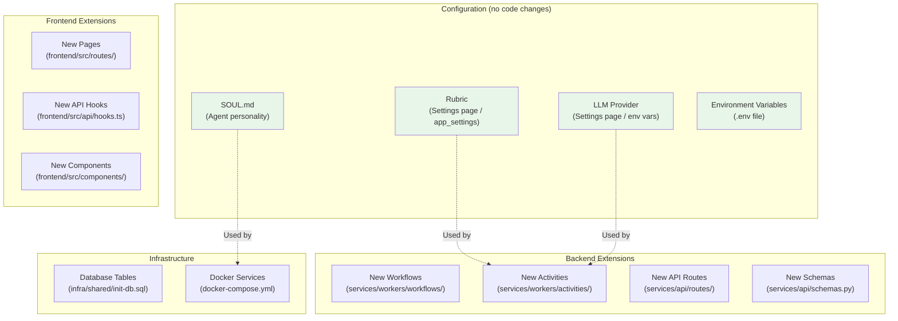
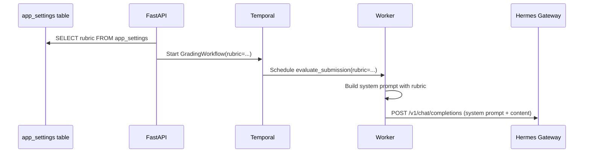

# Customization Guide

> This template is designed to be forked and customized. The included grading demo shows the full pattern (AI evaluate → human review → approve/reject) end-to-end. This guide explains how to build your own use case on top of the same infrastructure.

## Table of Contents

- [Extension Points](#extension-points)
- [Changing the Demo Grading Rubric](#changing-the-demo-grading-rubric)
- [Switching LLM Providers](#switching-llm-providers)
- [Modifying the Agent Personality](#modifying-the-agent-personality)
- [Building Your Own Use Case](#building-your-own-use-case)
- [Adding New Temporal Workflows](#adding-new-temporal-workflows)
- [Adding New API Endpoints](#adding-new-api-endpoints)
- [Adding New Frontend Pages](#adding-new-frontend-pages)
- [Configuring Authentication](#configuring-authentication)
- [Future Roadmap](#future-roadmap)
- [See Also](#see-also)

---

## Extension Points



---

## Changing the Demo Grading Rubric

The grading rubric defines the criteria the AI uses to evaluate submissions in the demo. It can be changed at runtime without code changes. When building your own use case, you'll replace this with your own evaluation criteria.

### Via the Settings Page (recommended)

1. Open the web UI and navigate to the Settings page
2. Edit the `rubric` setting
3. The rubric is a JSON object with this structure:

```json
{
  "name": "Custom Grading Rubric",
  "max_score": 100,
  "criteria": [
    {
      "name": "Technical Accuracy",
      "weight": 50,
      "description": "Correctness of technical concepts and implementations."
    },
    {
      "name": "Code Quality",
      "weight": 30,
      "description": "Clean code, proper naming, documentation, and error handling."
    },
    {
      "name": "Creativity",
      "weight": 20,
      "description": "Novel approaches and creative problem-solving."
    }
  ]
}
```

4. Click Save. The new rubric takes effect for the next submission.

### Via the API

```bash
curl -X PUT http://localhost:8000/api/settings/rubric \
  -H "Authorization: Bearer <token>" \
  -H "Content-Type: application/json" \
  -d '{
    "key": "rubric",
    "value": "{\"name\": \"CS101 Rubric\", \"max_score\": 100, \"criteria\": [{\"name\": \"Correctness\", \"weight\": 60, \"description\": \"Output matches expected results.\"}, {\"name\": \"Style\", \"weight\": 40, \"description\": \"Code follows PEP 8 and is well-documented.\"}]}"
  }'
```

### Additional grading instructions

Use the `grading_instructions` setting to provide extra context to the AI:

```bash
curl -X PUT http://localhost:8000/api/settings/grading_instructions \
  -H "Authorization: Bearer <token>" \
  -H "Content-Type: application/json" \
  -d '{
    "key": "grading_instructions",
    "value": "Be lenient on formatting for ESL students. Focus on content accuracy."
  }'
```

### How the rubric flows through the system



### Default rubric

The default rubric is inserted by `infra/shared/init-db.sql` and covers four criteria:
- Content & Accuracy (40%)
- Structure & Organization (25%)
- Critical Thinking (20%)
- Writing Quality (15%)

---

## Switching LLM Providers

### Via the Settings Page

1. Navigate to Settings in the web UI
2. Use the Provider Configuration section
3. Select a provider and model
4. Enter your API key (stored securely, only the last 4 characters are shown)

### Via the API

```bash
curl -X PUT http://localhost:8000/api/settings/provider \
  -H "Authorization: Bearer <token>" \
  -H "Content-Type: application/json" \
  -d '{
    "provider": "openrouter",
    "model": "anthropic/claude-3-haiku",
    "api_key": "sk-or-v1-your-key-here"
  }'
```

### Allowed providers

Currently the API accepts these provider values:
- `openrouter` -- [OpenRouter](https://openrouter.ai) (aggregates many LLM providers)
- `opencode-go` -- OpenCode Go

### Via environment variables

For the initial configuration (before the Settings page is used), set these in `infra/shared/.env`:

```bash
HERMES_MODEL_PROVIDER=openrouter    # Provider for the Hermes gateway
LLM_API_KEY=sk-or-v1-...            # API key passed to Hermes
```

### How provider selection works

The worker reads provider settings from two sources:
1. **Database first:** `app_settings` table (`hermes_provider`, `hermes_model`, `hermes_api_key`)
2. **Environment fallback:** If database values are empty, falls back to `HERMES_API_KEY` env var and `HERMES_DEFAULT_MODEL`

This means settings configured via the UI take precedence over environment variables.

### Adding a new provider

To add support for a new provider (e.g., `azure-openai`):

1. Add the provider ID to `ALLOWED_PROVIDERS` in `services/api/schemas.py`:
   ```python
   ALLOWED_PROVIDERS = {"openrouter", "opencode-go", "azure-openai"}
   ```

2. Configure the Hermes gateway to support the new provider. Hermes uses the `HERMES_MODEL_PROVIDER` env var in `services/hermes/config.yaml`.

3. Update the frontend provider selection UI if needed.

---

## Modifying the Agent Personality

The AI grading agent's behavior is defined in **SOUL.md**, a markdown file that serves as the agent's "personality definition."

**File:** `services/hermes/SOUL.md`

### What SOUL.md controls

| Section | Purpose |
|---|---|
| **Core Principles** | Fairness, evidence-based evaluation, constructive feedback, transparent reasoning |
| **Response Format** | Exact JSON structure the agent must return |
| **Evaluation Process** | Step-by-step process the agent follows |
| **Constraints** | Guardrails (no fabrication, no out-of-range scores, no conversation) |

### Example modifications

**Make the agent more lenient:**
```markdown
## Additional Guidelines
- When in doubt about partial credit, err on the side of generosity.
- Recognize effort and improvement even when answers are incomplete.
```

**Add domain-specific instructions:**
```markdown
## Domain: Computer Science
- Evaluate code submissions for both correctness and elegance.
- Accept multiple valid algorithmic approaches.
- Value proper error handling and edge case consideration.
```

**Change the response format:**
```markdown
## Response Format
Always respond with valid JSON matching this structure:
{
  "suggested_score": <number>,
  "strengths": ["..."],
  "weaknesses": ["..."],
  "reasoning": "...",
  "criterion_scores": {
    "<criterion_name>": <score>,
    ...
  }
}
```

Note: If you change the response format, you must also update `_parse_agent_response()` in `services/workers/activities/grading.py` and the `AgentFeedback` dataclass in `services/workers/schemas.py`.

### How SOUL.md is loaded

In development (with the docker-compose override), SOUL.md is mounted directly into the Hermes container:
```yaml
hermes-gateway:
  volumes:
    - ../../services/hermes/SOUL.md:/root/.hermes/SOUL.md:ro
```

Changes take effect on Hermes container restart.

---

## Building Your Own Use Case

The template's architecture is designed to be generic. The grading demo is just one example of the **AI evaluate → human review → approve/reject** pattern. Here are examples of how to adapt the template for different domains.

### Essay Review

**Changes needed:** Minimal. Update the rubric to focus on essay-specific criteria:

```json
{
  "name": "Essay Review Rubric",
  "max_score": 100,
  "criteria": [
    {"name": "Thesis & Argument", "weight": 35, "description": "Clear thesis, logical argument structure."},
    {"name": "Evidence & Sources", "weight": 30, "description": "Quality and relevance of citations."},
    {"name": "Writing & Style", "weight": 20, "description": "Clarity, grammar, academic tone."},
    {"name": "Originality", "weight": 15, "description": "Novel perspective, unique insights."}
  ]
}
```

Update SOUL.md to emphasize essay-specific evaluation.

### Code Review

**Changes needed:**
1. Update the rubric for code-specific criteria (correctness, style, performance, testing)
2. Modify SOUL.md to instruct the agent to analyze code structure
3. Optionally: add a new activity that runs the code in a sandbox and includes test results in the prompt

### Document Analysis

**Changes needed:**
1. Create a rubric for document quality (completeness, accuracy, formatting)
2. Update SOUL.md for document analysis context
3. The file upload functionality already supports this use case

### Multi-stage Review Pipeline

**Changes needed:**
1. Create a new workflow (see [Adding New Temporal Workflows](#adding-new-temporal-workflows))
2. Add multiple evaluation stages (e.g., plagiarism check -> content review -> formatting check)
3. Each stage can use a different prompt/rubric

---

## Adding New Temporal Workflows

See [Workflows - Extending with New Workflows](./WORKFLOWS.md#extending-with-new-workflows) for the detailed step-by-step guide.

### Quick summary

1. Define schemas in `services/workers/schemas.py`
2. Create activities in `services/workers/activities/`
3. Create the workflow in `services/workers/workflows/`
4. Register with the Temporal worker
5. Add an API endpoint to start the workflow
6. Test via the Temporal UI

---

## Adding New API Endpoints

### Step 1: Create a new route module

Create `services/api/routes/my_resource.py`:

```python
from fastapi import APIRouter

router = APIRouter(prefix="/my-resource", tags=["my-resource"])

@router.get("")
async def list_items():
    """List all items."""
    pool = await deps.get_pool()
    rows = await pool.fetch("SELECT * FROM my_table ORDER BY created_at DESC")
    return [dict(r) for r in rows]

@router.post("", status_code=201)
async def create_item(body: MyItemCreate):
    """Create a new item."""
    pool = await deps.get_pool()
    row = await pool.fetchrow(
        "INSERT INTO my_table (name) VALUES ($1) RETURNING *",
        body.name,
    )
    return dict(row)
```

### Step 2: Define Pydantic schemas

Add request/response models to `services/api/schemas.py`:

```python
class MyItemCreate(BaseModel):
    name: str = Field(..., min_length=1, max_length=255)

class MyItemResponse(BaseModel):
    id: uuid.UUID
    name: str
    created_at: datetime
```

### Step 3: Register the router

In `services/api/main.py`, add:

```python
from services.api.routes import my_resource

# With authentication:
app.include_router(my_resource.router, prefix="/api", dependencies=_auth_deps)

# Without authentication:
app.include_router(my_resource.router, prefix="/api")
```

### Step 4: Add frontend hooks

See [Adding New Frontend Pages](#adding-new-frontend-pages).

---

## Adding New Frontend Pages

The frontend uses TanStack Router with file-based routing. Creating a new page is straightforward.

### Step 1: Create a route file

Create `frontend/src/routes/my-page.tsx`:

```tsx
import { createFileRoute } from "@tanstack/react-router";

export const Route = createFileRoute("/my-page")({
  component: MyPage,
});

function MyPage() {
  return (
    <div className="p-8">
      <h1 className="text-2xl font-bold">My Page</h1>
      {/* Your content here */}
    </div>
  );
}
```

The route is automatically registered by TanStack Router's file-based routing.

### Step 2: Add API hooks

Add query/mutation hooks to `frontend/src/api/hooks.ts`:

```tsx
export function useMyItems() {
  const getToken = useToken();
  return useQuery({
    queryKey: ["my-items"],
    queryFn: async () => {
      const token = await getToken();
      return fetchJSON<MyItem[]>("/api/my-resource", undefined, token);
    },
  });
}
```

### Step 3: Add types

Add TypeScript types to `frontend/src/api/types.ts`:

```tsx
export interface MyItem {
  id: string;
  name: string;
  created_at: string;
}
```

### Step 4: Add navigation

Update the `NavBar` component in `frontend/src/components/nav-bar.tsx` to include a link to the new page.

---

## Configuring Authentication

The template uses [better-auth](https://better-auth.com) for self-hosted authentication.

### Email + Password (always enabled)

No additional configuration needed. Users sign up and sign in with email and password at the `/login` page.

### Google OAuth

1. Go to [Google Cloud Console](https://console.cloud.google.com/apis/credentials)
2. Create an OAuth 2.0 Client ID
3. Set the authorized redirect URI to: `http://localhost:3100/api/auth/callback/google` (local) or `https://yourdomain.com/auth/api/auth/callback/google` (production)
4. Add to `.env`:
   ```bash
   GOOGLE_CLIENT_ID=your-client-id.apps.googleusercontent.com
   GOOGLE_CLIENT_SECRET=GOCSPX-your-client-secret
   ```

### GitHub OAuth

1. Go to [GitHub Developer Settings](https://github.com/settings/developers)
2. Create a new OAuth App
3. Set the authorization callback URL to: `http://localhost:3100/api/auth/callback/github` (local) or `https://yourdomain.com/auth/api/auth/callback/github` (production)
4. Add to `.env`:
   ```bash
   GITHUB_CLIENT_ID=Ov23li...
   GITHUB_CLIENT_SECRET=your-github-secret
   ```

### How auth is configured

The auth service (`services/auth/index.ts`) conditionally enables OAuth providers:

```typescript
socialProviders: {
  google: {
    enabled: !!(process.env.GOOGLE_CLIENT_ID && process.env.GOOGLE_CLIENT_SECRET),
    clientId: process.env.GOOGLE_CLIENT_ID || "",
    clientSecret: process.env.GOOGLE_CLIENT_SECRET || "",
  },
  github: {
    enabled: !!(process.env.GITHUB_CLIENT_ID && process.env.GITHUB_CLIENT_SECRET),
    clientId: process.env.GITHUB_CLIENT_ID || "",
    clientSecret: process.env.GITHUB_CLIENT_SECRET || "",
  },
},
```

If the env vars are empty, the provider is disabled. The OAuth buttons may still appear in the UI but will not function.

### Dev mode

When `AUTH_SECRET` is not set (or set to `dev-secret-change-in-production`), the FastAPI backend bypasses authentication entirely. Every request is treated as coming from a dev user (`dev@localhost`). This is controlled in `services/api/auth.py`:

```python
if not os.environ.get("AUTH_SECRET"):
    return {"sub": "dev-user", "email": "dev@localhost"}
```

The frontend still requires sign-in through the auth service, so you need to create a user on first run.

---

## Future Roadmap

### LTI Integration (Learning Management System)

The `record_final_grade` activity in `services/workers/activities/grading.py` includes a comment noting future LTI grade passback support:

```python
# Future versions will perform LTI grade passback.
```

To add LTI:
1. Add LTI configuration tables to the database (tool registration, resource links)
2. Implement LTI 1.3 launch and grade passback in a new route module
3. Extend `record_final_grade` to call the LMS grade passback endpoint

### Paperclip Multi-Agent Governance

Paperclip could be added as a governance layer for multi-agent workflows:
1. Add a Paperclip service to Docker Compose
2. Route AI evaluation requests through Paperclip for policy enforcement
3. Use Paperclip to audit and log all AI decisions
4. Implement approval chains for sensitive grading decisions

### Notification System

The `notify_reviewer` activity currently only updates the database. Future extensions:
1. Email notifications (SMTP integration)
2. Slack/Teams webhooks
3. Push notifications to the browser

---

## See Also

- [Architecture](./ARCHITECTURE.md) -- System overview and design rationale
- [API Reference](./API.md) -- Endpoint documentation for new routes
- [Workflows](./WORKFLOWS.md) -- Temporal workflow details and extension guide
- [Data Model](./DATA_MODEL.md) -- Database schema for new tables
- [Deployment Guide](./DEPLOYMENT.md) -- Environment variable reference
