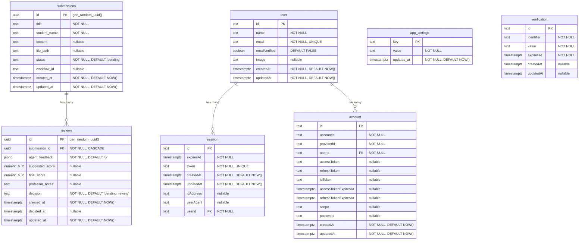
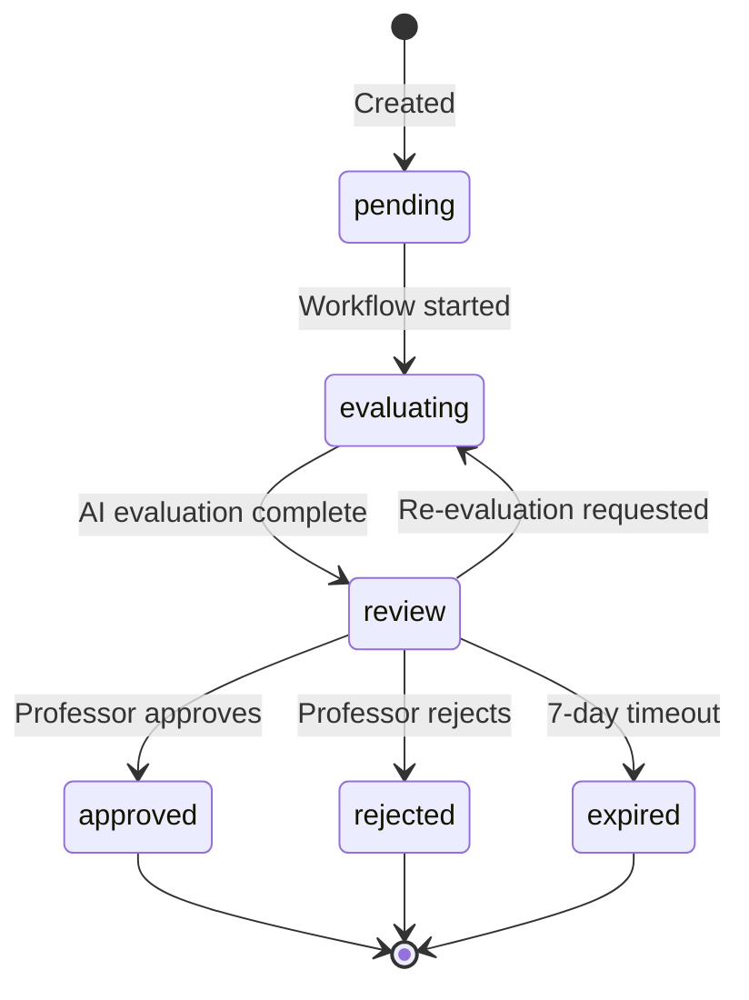
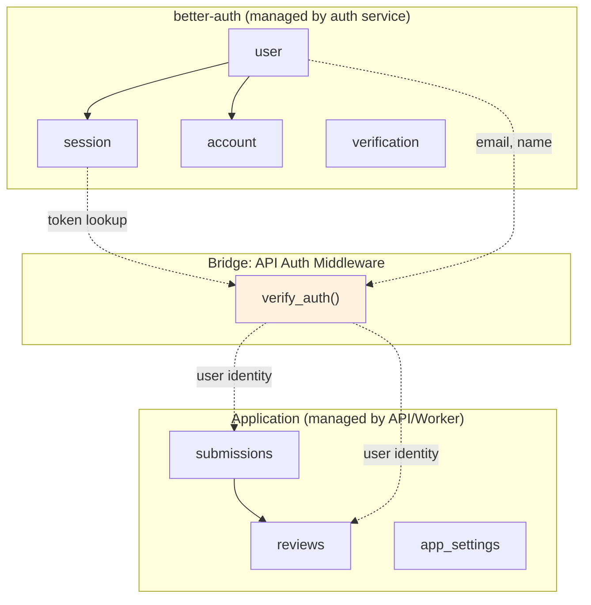

# Data Model

> Complete database schema documentation for the Hermes Agent Solution Template (HAST).

## Table of Contents

- [Overview](#overview)
- [ER Diagram](#er-diagram)
- [Application Tables](#application-tables)
  - [submissions](#submissions)
  - [reviews](#reviews)
  - [app_settings](#app_settings)
- [Authentication Tables (better-auth)](#authentication-tables-better-auth)
  - [user](#user)
  - [session](#session)
  - [account](#account)
  - [verification](#verification)
- [Status Enums](#status-enums)
- [Index Strategy](#index-strategy)
- [How Auth Tables Relate to App Tables](#how-auth-tables-relate-to-app-tables)
- [Migration Strategy](#migration-strategy)
- [Example Queries](#example-queries)
- [See Also](#see-also)

---

## Overview

The template uses a single PostgreSQL 15 instance with **two logical databases**:

> **Note:** The `submissions` and `reviews` tables are specific to the included grading demo. When building your own use case, you'll create domain-specific tables following the same patterns. The authentication tables (`user`, `session`, `account`, `verification`) and the `app_settings` table are part of the core template infrastructure and are reusable across any use case.

| Database | Owner | Purpose |
|---|---|---|
| `temporal` | `temporal` | Temporal Server workflow state. Created automatically by `temporalio/auto-setup`. Do not modify. |
| `app_db` | `app_user` | Application data: submissions, reviews, settings, and authentication tables. |

All application tables are in the `public` schema of `app_db`. The schema is initialized by `infra/shared/init-db.sql` on first container start.

**Connection details:**
- Host: `postgres` (Docker) or `localhost:5432` (host)
- App user: `app_user` / `app_password`
- Superuser: `temporal` / `temporal`

---

## ER Diagram



---

## Application Tables (Demo-Specific)

### submissions

Stores every student submission uploaded through the grading demo. When building your own use case, this table serves as an example of how to structure your domain-specific data.

**Source:** `infra/shared/init-db.sql`

| Column | Type | Nullable | Default | Description |
|---|---|---|---|---|
| `id` | `UUID` | No | `gen_random_uuid()` | Primary key |
| `title` | `TEXT` | No | -- | Submission title (e.g., "Midterm Essay Q3") |
| `student_name` | `TEXT` | No | -- | Name of the student |
| `content` | `TEXT` | Yes | -- | Full text content of the submission |
| `file_path` | `TEXT` | Yes | -- | Path to uploaded file (if file upload was used) |
| `status` | `TEXT` | No | `'pending'` | Current workflow status. CHECK constraint enforces valid values. |
| `workflow_id` | `TEXT` | Yes | -- | Temporal workflow ID (e.g., `grading-a1b2c3d4-...`) |
| `created_at` | `TIMESTAMPTZ` | No | `NOW()` | When the submission was uploaded |
| `updated_at` | `TIMESTAMPTZ` | No | `NOW()` | Last modification time |

**Constraints:**
- `valid_status` CHECK: status must be one of `'pending'`, `'evaluating'`, `'review'`, `'approved'`, `'rejected'`, `'expired'`

---

### reviews

Stores AI evaluation results and professor decisions in the grading demo. A submission can have multiple reviews (one per evaluation cycle). This table demonstrates the pattern for storing AI feedback alongside human decisions.

| Column | Type | Nullable | Default | Description |
|---|---|---|---|---|
| `id` | `UUID` | No | `gen_random_uuid()` | Primary key |
| `submission_id` | `UUID` | No | -- | Foreign key to `submissions.id` (CASCADE delete) |
| `agent_feedback` | `JSONB` | No | `'{}'::jsonb` | Structured AI feedback (score, strengths, weaknesses, reasoning) |
| `suggested_score` | `NUMERIC(5,2)` | Yes | -- | AI's suggested score (e.g., 82.50) |
| `final_score` | `NUMERIC(5,2)` | Yes | -- | Professor's final score (may differ from suggested) |
| `professor_notes` | `TEXT` | Yes | -- | Professor's comments on the review |
| `decision` | `TEXT` | No | `'pending_review'` | Review decision status |
| `created_at` | `TIMESTAMPTZ` | No | `NOW()` | When the review was created (usually when AI evaluation completed) |
| `decided_at` | `TIMESTAMPTZ` | Yes | -- | When the professor made their decision |
| `updated_at` | `TIMESTAMPTZ` | No | `NOW()` | Last modification time |

**Constraints:**
- `valid_decision` CHECK: decision must be one of `'pending_review'`, `'approved'`, `'rejected'`, `'re_evaluate'`
- Foreign key: `submission_id` references `submissions(id)` with `ON DELETE CASCADE`

**`agent_feedback` JSONB structure:**
```json
{
  "suggested_score": 82.5,
  "strengths": [
    "Clear thesis statement with supporting evidence",
    "Good use of primary sources"
  ],
  "weaknesses": [
    "Missing conclusion paragraph",
    "Some factual inaccuracies in section 2"
  ],
  "reasoning": "The submission demonstrates a solid understanding of the topic..."
}
```

---

### app_settings (Core Template)

Key-value store for application configuration. Uses a singleton pattern -- each setting is one row. This table is part of the core template infrastructure and is reusable for any use case.

| Column | Type | Nullable | Default | Description |
|---|---|---|---|---|
| `key` | `TEXT` | No | -- | Setting name (primary key) |
| `value` | `TEXT` | No | -- | Setting value (often JSON for complex settings) |
| `updated_at` | `TIMESTAMPTZ` | No | `NOW()` | Last modification time |

**Default settings (inserted by init-db.sql):**

| Key | Default Value | Description |
|---|---|---|
| `rubric` | JSON with 4 criteria | Grading rubric definition |
| `grading_instructions` | `""` (empty) | Additional grading instructions |
| `max_score` | `"100"` | Maximum possible score |
| `hermes_model` | `"glm-5"` | Default LLM model name |

**Runtime settings (created via API):**

| Key | Description |
|---|---|
| `hermes_provider` | LLM provider name (e.g., `openrouter`) |
| `hermes_model` | LLM model name (e.g., `anthropic/claude-3-haiku`) |
| `hermes_api_key` | LLM provider API key (protected -- never returned in full by the API) |

---

## Authentication Tables (Core Template -- better-auth)

These tables are part of the core template infrastructure and are managed by the [better-auth](https://better-auth.com) library. They are reusable across any use case. They use **camelCase** column names (better-auth convention), while the application tables use **snake_case**.

### user

Stores registered users (professors).

| Column | Type | Nullable | Default | Description |
|---|---|---|---|---|
| `id` | `TEXT` | No | -- | Primary key (generated by better-auth) |
| `name` | `TEXT` | No | -- | Display name |
| `email` | `TEXT` | No | -- | Email address (UNIQUE) |
| `emailVerified` | `BOOLEAN` | No | `FALSE` | Whether email has been verified |
| `image` | `TEXT` | Yes | -- | Profile image URL (from OAuth) |
| `createdAt` | `TIMESTAMPTZ` | No | `NOW()` | Registration time |
| `updatedAt` | `TIMESTAMPTZ` | No | `NOW()` | Last update time |

### session

Stores active login sessions. Queried by the FastAPI auth middleware to verify requests.

| Column | Type | Nullable | Default | Description |
|---|---|---|---|---|
| `id` | `TEXT` | No | -- | Primary key |
| `expiresAt` | `TIMESTAMPTZ` | No | -- | Session expiration time |
| `token` | `TEXT` | No | -- | Session token (UNIQUE). This is the value in the `better-auth.session_token` cookie and `Bearer` header. |
| `createdAt` | `TIMESTAMPTZ` | No | `NOW()` | Session creation time |
| `updatedAt` | `TIMESTAMPTZ` | No | `NOW()` | Last activity time |
| `ipAddress` | `TEXT` | Yes | -- | Client IP address |
| `userAgent` | `TEXT` | Yes | -- | Client user agent string |
| `userId` | `TEXT` | No | -- | Foreign key to `user.id` |

### account

Links users to authentication providers (email/password, Google, GitHub).

| Column | Type | Nullable | Default | Description |
|---|---|---|---|---|
| `id` | `TEXT` | No | -- | Primary key |
| `accountId` | `TEXT` | No | -- | Provider-specific account ID |
| `providerId` | `TEXT` | No | -- | Provider name (`credential`, `google`, `github`) |
| `userId` | `TEXT` | No | -- | Foreign key to `user.id` |
| `accessToken` | `TEXT` | Yes | -- | OAuth access token |
| `refreshToken` | `TEXT` | Yes | -- | OAuth refresh token |
| `idToken` | `TEXT` | Yes | -- | OAuth ID token |
| `accessTokenExpiresAt` | `TIMESTAMPTZ` | Yes | -- | Access token expiration |
| `refreshTokenExpiresAt` | `TIMESTAMPTZ` | Yes | -- | Refresh token expiration |
| `scope` | `TEXT` | Yes | -- | OAuth scopes |
| `password` | `TEXT` | Yes | -- | Hashed password (for `credential` provider) |
| `createdAt` | `TIMESTAMPTZ` | No | `NOW()` | Creation time |
| `updatedAt` | `TIMESTAMPTZ` | No | `NOW()` | Last update time |

### verification

Stores email verification and password reset tokens.

| Column | Type | Nullable | Default | Description |
|---|---|---|---|---|
| `id` | `TEXT` | No | -- | Primary key |
| `identifier` | `TEXT` | No | -- | What is being verified (e.g., email address) |
| `value` | `TEXT` | No | -- | Verification token/code |
| `expiresAt` | `TIMESTAMPTZ` | No | -- | Token expiration |
| `createdAt` | `TIMESTAMPTZ` | Yes | -- | Creation time |
| `updatedAt` | `TIMESTAMPTZ` | Yes | -- | Last update time |

---

## Status Enums

### Submission Status



| Status | Meaning |
|---|---|
| `pending` | Submission uploaded, workflow not yet started |
| `evaluating` | AI agent is evaluating the submission |
| `review` | AI evaluation complete, waiting for professor review |
| `approved` | Professor approved the grade |
| `rejected` | Professor rejected the submission |
| `expired` | No review received within the timeout period (7 days) |

### Review Decision

| Decision | Meaning |
|---|---|
| `pending_review` | AI evaluation created, professor has not yet acted |
| `approved` | Professor approved the grade |
| `rejected` | Professor rejected the submission |
| `re_evaluate` | Professor requested re-evaluation with feedback |

---

## Index Strategy

```sql
-- Submissions: filter by status (dashboard queries)
CREATE INDEX submissions_status_idx ON submissions (status);

-- Submissions: search by student name
CREATE INDEX submissions_student_name_idx ON submissions (student_name);

-- Submissions: sort by newest first (default list order)
CREATE INDEX submissions_created_at_idx ON submissions (created_at DESC);

-- Reviews: look up reviews by submission
CREATE INDEX reviews_submission_id_idx ON reviews (submission_id);

-- Reviews: filter by decision status
CREATE INDEX reviews_decision_idx ON reviews (decision);
```

### Index rationale

| Index | Used By | Query Pattern |
|---|---|---|
| `submissions_status_idx` | Stats endpoint, dashboard | `WHERE status IN ('review', 'evaluating', 'pending')` |
| `submissions_student_name_idx` | Future: student search | `WHERE student_name = $1` |
| `submissions_created_at_idx` | Submission list | `ORDER BY created_at DESC` |
| `reviews_submission_id_idx` | Review list, submission detail | `WHERE submission_id = $1` |
| `reviews_decision_idx` | Stats (agreement rate) | `WHERE final_score IS NOT NULL` |

---

## How Auth Tables Relate to App Tables

The authentication tables and application tables are **independent** -- there are no foreign keys between them. They coexist in the same `app_db` database but serve different purposes:



The connection point is the `verify_auth()` dependency in `services/api/auth.py`, which:
1. Reads the session token from the request
2. Queries `session` joined with `user` to validate and get user info
3. Returns `{sub, email, name}` to the route handler

Currently, submissions and reviews do not store the user ID (all professors see all submissions). This is a future extension point for multi-tenant support.

---

## Migration Strategy

The platform does not use a migration tool (like Alembic or Flyway). Schema changes are managed manually.

### Adding a new column

1. Write and test the ALTER statement:
   ```sql
   ALTER TABLE submissions ADD COLUMN category TEXT DEFAULT 'general';
   ```

2. Apply to running database:
   ```bash
   docker compose -f infra/shared/docker-compose.yml exec postgres \
     psql -U app_user -d app_db -c "ALTER TABLE submissions ADD COLUMN category TEXT DEFAULT 'general';"
   ```

3. Update `infra/shared/init-db.sql` for new installations.

4. Update Pydantic models (`services/api/schemas.py`) and dataclasses (`services/workers/schemas.py`).

### Adding a new table

1. Write the CREATE TABLE statement.
2. Apply to running database via `psql`.
3. Add to `infra/shared/init-db.sql`.
4. Create API routes and schemas.

### Recommended migration process

For production environments, consider:
1. Keep a `migrations/` directory with numbered SQL files (e.g., `001_add_category.sql`)
2. Apply migrations in order during deployment
3. Test migrations against a copy of the production database first
4. Always make migrations backward-compatible (add columns with defaults, don't drop columns)

---

## Example Queries

### List all submissions awaiting review

```sql
SELECT id, title, student_name, created_at
FROM submissions
WHERE status = 'review'
ORDER BY created_at ASC;
```

### Get a submission with its latest review

```sql
SELECT s.*, r.agent_feedback, r.suggested_score, r.final_score, r.decision
FROM submissions s
LEFT JOIN reviews r ON r.submission_id = s.id
WHERE s.id = 'a1b2c3d4-...'
ORDER BY r.created_at DESC
LIMIT 1;
```

### Dashboard statistics

```sql
-- Total submissions
SELECT count(*) FROM submissions;

-- Pending reviews
SELECT count(*) FROM submissions WHERE status IN ('review', 'evaluating', 'pending');

-- Average final score
SELECT avg(final_score) FROM reviews WHERE final_score IS NOT NULL;

-- Agent agreement rate (professor accepted AI score as-is)
SELECT
  count(*) FILTER (WHERE final_score = suggested_score) AS agreed,
  count(*) FILTER (WHERE final_score IS NOT NULL AND suggested_score IS NOT NULL) AS total
FROM reviews;
```

### Get all reviews for a submission (evaluation history)

```sql
SELECT id, agent_feedback, suggested_score, final_score,
       professor_notes, decision, created_at
FROM reviews
WHERE submission_id = 'a1b2c3d4-...'
ORDER BY created_at DESC;
```

### Current grading rubric

```sql
SELECT value FROM app_settings WHERE key = 'rubric';
```

### Active user sessions

```sql
SELECT s.token, s."createdAt", s."expiresAt", u.email, u.name
FROM session s
JOIN "user" u ON s."userId" = u.id
WHERE s."expiresAt" > NOW()
ORDER BY s."createdAt" DESC;
```

### Find submissions by student name

```sql
SELECT id, title, status, created_at
FROM submissions
WHERE student_name ILIKE '%smith%'
ORDER BY created_at DESC;
```

---

## See Also

- [Architecture](./ARCHITECTURE.md) -- How the database fits in the overall system
- [API Reference](./API.md) -- Endpoints that read/write these tables
- [Workflows](./WORKFLOWS.md) -- How workflows update submission and review records
- [Deployment Guide](./DEPLOYMENT.md) -- Database management, backup, and reset
