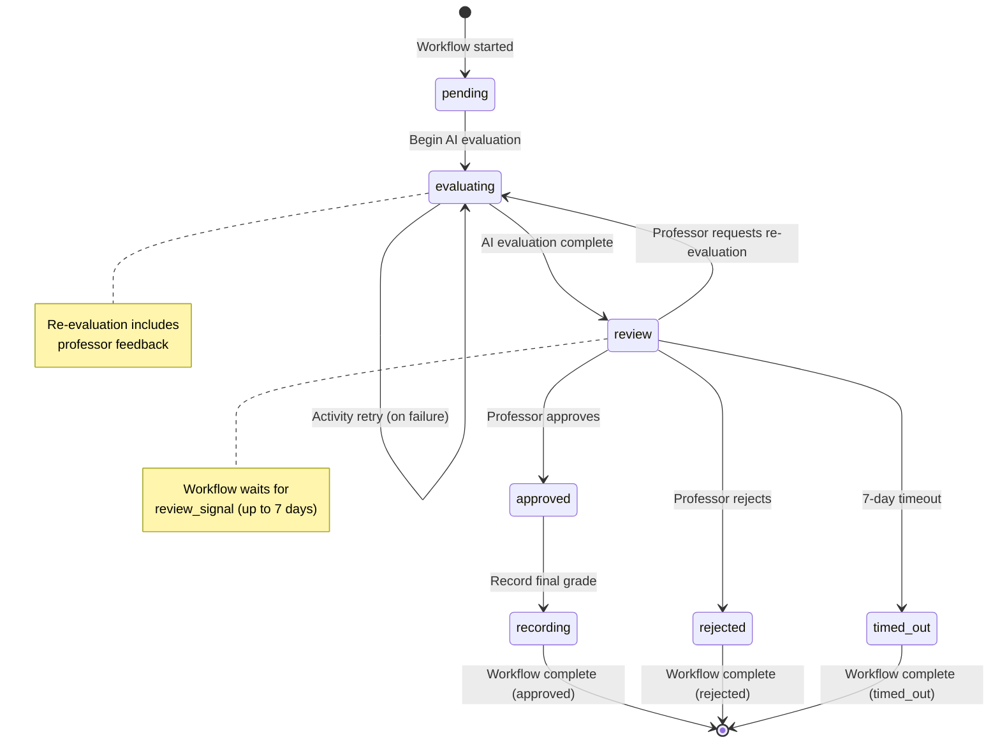
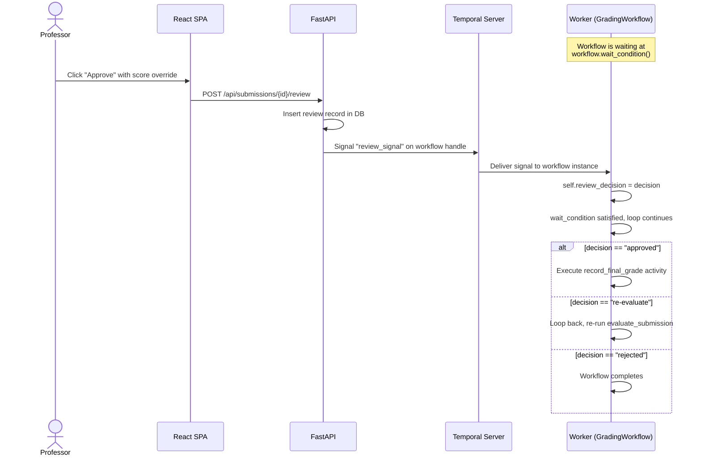
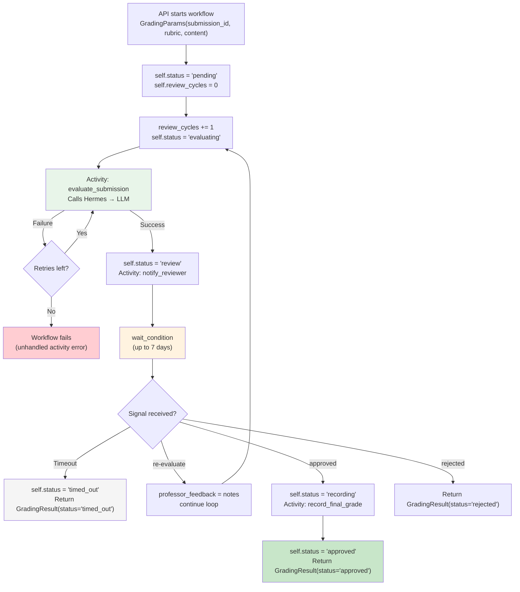
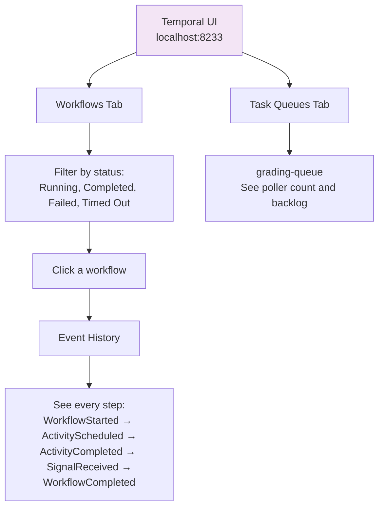

# Temporal Workflows

> Deep dive into the Temporal-powered workflow engine and the human-in-the-loop pattern. The included GradingWorkflow is a demo that showcases the reusable pattern: AI evaluate → human review → approve/reject. This same pattern applies to any domain -- document review, code review, content moderation, and more.

## Table of Contents

- [What is Temporal?](#what-is-temporal)
- [Why Temporal for Grading](#why-temporal-for-grading)
- [The GradingWorkflow](#the-gradingworkflow)
- [Workflow State Diagram](#workflow-state-diagram)
- [Activity Functions](#activity-functions)
- [Signal Handling](#signal-handling)
- [Workflow Lifecycle](#workflow-lifecycle)
- [Human-in-the-Loop Pattern](#human-in-the-loop-pattern)
- [Error Handling and Retry Policies](#error-handling-and-retry-policies)
- [Temporal UI Walkthrough](#temporal-ui-walkthrough)
- [Extending with New Workflows](#extending-with-new-workflows)
- [See Also](#see-also)

---

## What is Temporal?

[Temporal](https://temporal.io) is a durable execution platform. It guarantees that workflows run to completion even if processes crash, networks fail, or servers restart. Temporal achieves this by persisting every workflow step to a database (PostgreSQL in our case) and replaying events on recovery.

Key concepts:

| Concept | Description |
|---|---|
| **Workflow** | A function that orchestrates a sequence of steps. Survives crashes. Can wait for days. |
| **Activity** | A single unit of work (e.g., call an API, write to a database). Can be retried automatically. |
| **Signal** | An external message sent to a running workflow (e.g., professor's review decision). |
| **Query** | A read-only request to inspect workflow state without affecting it. |
| **Task Queue** | A named queue where workers poll for work. Allows routing specific workflows to specific workers. |
| **Worker** | A process that registers workflow and activity implementations and polls a task queue. |

In this template:
- **Temporal Server** runs as the `temporal` container (port 7233)
- **Temporal UI** runs as `temporal-ui` (port 8233)
- **Worker** runs as the `worker` container, polling the task queue (the demo uses `grading-queue`)

---

## Why Temporal for Human-in-the-Loop Workflows

Human-in-the-loop workflows (like the grading demo) have requirements that are difficult to implement reliably with simple queues or cron jobs:

1. **Long-running waits:** After AI evaluation, the workflow waits up to 7 days for a professor to review. Temporal handles this natively without consuming a thread or process.

2. **Crash recovery:** If the worker crashes during AI evaluation, Temporal automatically retries the activity on restart. No data is lost.

3. **Human-in-the-loop:** The professor's review decision is injected into the running workflow via a signal. The workflow resumes exactly where it left off.

4. **Re-evaluation loops:** If the professor requests re-evaluation, the workflow loops back and re-runs the AI evaluation with their feedback. Temporal tracks the full history.

5. **Visibility:** Every step is recorded in Temporal's event history. The Temporal UI shows exactly what happened, when, and why.

---

## The GradingWorkflow (Demo)

**Source:** `services/workers/workflows/grading.py`

The `GradingWorkflow` is the demo workflow that ships with the template. It coordinates three activities in a loop and demonstrates the full evaluate → review → approve pattern that you can replicate for your own use case:

```python
@workflow.defn
class GradingWorkflow:
    # State
    review_decision: ReviewDecision | None = None
    status: str = "pending"
    review_cycles: int = 0

    # Signal: professor's decision injected here
    @workflow.signal
    async def review_signal(self, decision: ReviewDecision):
        self.review_decision = decision

    # Query: check current status
    @workflow.query
    def get_status(self) -> str:
        return self.status

    # Main execution
    @workflow.run
    async def run(self, params: GradingParams) -> GradingResult:
        # ... orchestration loop
```

### Input and Output Types

**Source:** `services/workers/schemas.py`

```python
@dataclass
class GradingParams:          # Workflow input
    submission_id: str
    student_name: str = ""    # Deprecated: kept for backward compatibility
    rubric: str = ""          # Deprecated: kept for backward compatibility
    content: str = ""         # Deprecated: kept for backward compatibility

@dataclass
class GradingResult:          # Workflow output
    submission_id: str
    status: str               # "approved", "rejected", "timed_out", or "max_cycles_reached"
    agent_feedback: AgentFeedback | None
    final_score: float | None
    professor_notes: str
    review_cycles: int        # How many evaluation rounds

@dataclass
class AgentFeedback:          # AI evaluation result
    suggested_score: float
    strengths: list[str]
    weaknesses: list[str]
    reasoning: str

@dataclass
class ReviewDecision:         # Signal payload from professor
    review_id: str
    decision: str             # "approved", "rejected", or "re-evaluate"
    final_score: float | None
    professor_notes: str
```

---

## Workflow State Diagram



---

## Activity Functions

**Source:** `services/workers/activities/grading.py`

### `evaluate_submission`

The core AI grading activity. Calls the Hermes gateway to evaluate a student submission.

**Parameters:**
- `submission_id` (str) -- UUID of the submission
- `professor_feedback` (str | None) -- Feedback from a previous review cycle (for re-evaluation)

**What it does:**
1. Fetches submission content and rubric from the database using `submission_id`
2. Reads LLM provider settings from `app_settings` table (provider, model, api_key)
3. Builds a system prompt with the rubric (and professor feedback if re-evaluating)
4. Calls `POST {HERMES_API_URL}/v1/chat/completions` with the system prompt and submission content
5. Parses the structured JSON response (`suggested_score`, `strengths`, `weaknesses`, `reasoning`)

**Returns:** `AgentFeedback` dataclass

**Retry policy:** 5 attempts, exponential backoff (10s initial, 5min max), 180s start_to_close timeout per attempt.

### `notify_reviewer`

Notifies the professor that a submission is ready for review.

**Parameters:**
- `submission_id` (str) -- UUID of the submission (student name fetched from DB)
- `suggested_score` (float) -- AI's suggested score

**What it does:**
- Currently: Updates the submission status to `'review'` in Postgres
- Future: Send email, Slack, or WhatsApp notifications

**Timeout:** 30 seconds, default retry policy.

### `record_final_grade`

Records the final grade after professor approval or rejection.

**Parameters:**
- `submission_id` (str) -- UUID of the submission
- `review_id` (str) -- UUID of the review record
- `final_score` (float) -- The final grade
- `professor_notes` (str) -- Professor's notes
- `decision` (str, default `"approved"`) -- The professor's decision (`"approved"` or `"rejected"`)

**What it does:**
1. Updates the review record: sets `final_score`, `professor_notes`, `decision`, `decided_at`
2. Updates the submission status to match the decision
3. Future: Perform LTI grade passback to an LMS

**Timeout:** 30 seconds, default retry policy.

---

## Signal Handling

Signals are the mechanism for external input (professor's review decision) to reach a running workflow.

### How signals work



### Signal payload

The `ReviewDecision` dataclass is the signal payload:

```python
@dataclass
class ReviewDecision:
    review_id: str            # UUID of the review record
    decision: str             # "approved", "rejected", or "re-evaluate"
    final_score: float | None # Override score (None = use agent's score)
    professor_notes: str      # Free-text notes
```

### Signal delivery in the API

The API sends the signal via the Temporal client in `services/api/routes/reviews.py`:

```python
temporal = await deps.get_temporal_client()
handle = temporal.get_workflow_handle(sub["workflow_id"])
await handle.signal(
    "review_signal",
    ReviewDecision(
        review_id=str(review_id),
        decision=signal_decision_map[body.decision],
        final_score=body.final_score,
        professor_notes=body.notes or "",
    ),
)
```

### Wait condition in the workflow

The workflow uses `workflow.wait_condition` with a 7-day timeout:

```python
try:
    await workflow.wait_condition(
        lambda: self.review_decision is not None,
        timeout=REVIEW_WAIT_TIMEOUT,  # timedelta(days=7)
    )
except TimeoutError:
    # No review received in 7 days
    self.status = "timed_out"
    return GradingResult(status="timed_out", ...)
```

---

## Workflow Lifecycle

### Complete lifecycle with all paths



### Status transitions

| From | To | Trigger |
|---|---|---|
| `pending` | `evaluating` | Workflow starts first evaluation cycle |
| `evaluating` | `review` | AI evaluation completes successfully |
| `review` | `evaluating` | Professor signals `re-evaluate` |
| `review` | `approved` | Professor signals `approved` |
| `review` | `rejected` | Professor signals `rejected` |
| `review` | `timed_out` | 7-day timeout with no signal |

---

## Human-in-the-Loop Pattern

The human-in-the-loop pattern is the core design principle of this template. The grading demo showcases it end-to-end, but the same pattern applies to any use case where AI output requires human review. Here is how it works technically:

### 1. Workflow enters wait state

After the AI evaluates a submission, the workflow enters a durable wait state. This does NOT consume a thread, a process, or memory. The workflow state is persisted to Temporal's database, and the worker is free to process other tasks.

### 2. Professor reviews asynchronously

The professor can take minutes, hours, or days to review the submission. They use the split-view UI in the React frontend to see the submission content alongside the AI's feedback (score, strengths, weaknesses, reasoning).

### 3. Signal resumes the workflow

When the professor makes a decision (approve, reject, or re-evaluate), the API sends a Temporal signal. The Temporal server wakes up the workflow, the worker picks it up, and execution continues from exactly where it paused.

### 4. Re-evaluation loop

If the professor requests re-evaluation with feedback, the workflow loops back to the AI evaluation step. The professor's feedback is included in the system prompt as additional context. This can happen multiple times -- `review_cycles` tracks how many rounds occurred.

### 5. Timeout safety net

If no signal arrives within 7 days (`GRADING_TIMEOUT_DAYS`), the workflow times out gracefully rather than hanging forever. The submission is marked as `expired`.

---

## Error Handling and Retry Policies

### Activity retry policy

The `evaluate_submission` activity uses a custom retry policy:

```python
AGENT_RETRY_POLICY = RetryPolicy(
    initial_interval=timedelta(seconds=10),   # First retry after 10s
    maximum_interval=timedelta(minutes=5),    # Max wait between retries
    maximum_attempts=5,                       # Total 5 attempts
    backoff_coefficient=2.0,
)
```

This handles transient failures like:
- LLM provider rate limits
- Hermes gateway temporary unavailability
- Network timeouts

### Activity timeouts

| Activity | start_to_close | schedule_to_close | Description |
|---|---|---|---|
| `evaluate_submission` | 180 seconds | 25 minutes | LLM calls can take 30-60 seconds |
| `notify_reviewer` | 30 seconds | 5 minutes | Simple DB update |
| `record_final_grade` | 30 seconds | 5 minutes | Simple DB update |

### What happens on failure

1. **Activity fails within retry policy:** Temporal retries automatically with exponential backoff.
2. **Activity exhausts all retries:** The activity raises an error. Since the workflow doesn't catch it, the workflow fails.
3. **Worker crashes mid-activity:** On restart, the worker re-polls Temporal and the activity is re-dispatched.
4. **Worker crashes mid-workflow:** The workflow replays from its last checkpoint. Completed activities are not re-executed.

### Non-retryable errors

Some errors should not be retried (e.g., invalid rubric JSON, malformed LLM response). Currently these are handled by the default retry policy. Future improvement: add `non_retryable_error_types` to the retry policy.

---

## Temporal UI Walkthrough

Access the Temporal UI at **http://localhost:8233**.

### What to look for



### Key views

1. **Workflow list:** Shows all workflows with their status (Running, Completed, Failed, Timed Out). Filter by workflow type `GradingWorkflow`.

2. **Workflow detail:** Click a workflow ID (e.g., `grading-a1b2c3d4-...`) to see:
   - **Input:** The `GradingParams` passed when the workflow started
   - **Result:** The `GradingResult` returned when the workflow completed
   - **Event History:** Every event in chronological order

3. **Event history (most useful):** Shows the full execution trace:
   - `WorkflowExecutionStarted` -- Workflow began
   - `ActivityTaskScheduled` / `ActivityTaskCompleted` -- Activity execution
   - `WorkflowSignalReceived` -- Professor's review decision arrived
   - `TimerStarted` / `TimerFired` -- The 7-day timeout timer
   - `WorkflowExecutionCompleted` -- Workflow finished

4. **Pending activities:** If an activity is stuck (e.g., Hermes is down), you'll see `ActivityTaskScheduled` without a corresponding `ActivityTaskCompleted`.

5. **Queries:** You can query a running workflow's status using the "Query" tab with the `get_status` handler.

---

## Building Your Own Workflows

The GradingWorkflow is just the demo. The template is designed to be extended with your own domain-specific workflows following the same pattern. Here is the step-by-step guide:

#### 1. Define schemas

Create data classes for your workflow's input, output, and any signal payloads in `services/workers/schemas.py`:

```python
@dataclass
class MyWorkflowParams:
    item_id: str
    config: str

@dataclass
class MyWorkflowResult:
    item_id: str
    status: str
    output: str
```

#### 2. Create activity functions

Add a new file `services/workers/activities/my_activity.py`:

```python
from temporalio import activity

@activity.defn
async def process_item(item_id: str, config: str) -> str:
    """Your activity logic here."""
    activity.logger.info("Processing item %s", item_id)
    # Do work...
    return "result"
```

#### 3. Create the workflow

Add a new file `services/workers/workflows/my_workflow.py`:

```python
from datetime import timedelta
from temporalio import workflow
from temporalio.common import RetryPolicy

with workflow.unsafe.imports_passed_through():
    from services.workers.activities.my_activity import process_item
    from services.workers.schemas import MyWorkflowParams, MyWorkflowResult

@workflow.defn
class MyWorkflow:
    @workflow.run
    async def run(self, params: MyWorkflowParams) -> MyWorkflowResult:
        result = await workflow.execute_activity(
            process_item,
            args=[params.item_id, params.config],
            start_to_close_timeout=timedelta(seconds=60),
            retry_policy=RetryPolicy(maximum_attempts=3),
        )
        return MyWorkflowResult(
            item_id=params.item_id,
            status="completed",
            output=result,
        )
```

#### 4. Register the workflow with the worker

Update the worker startup code to register your new workflow and activities with the Temporal worker.

#### 5. Add an API endpoint to start the workflow

Add a route in `services/api/routes/` that starts your workflow:

```python
temporal = await deps.get_temporal_client()
await temporal.start_workflow(
    "MyWorkflow",
    MyWorkflowParams(item_id=str(item_id), config=config),
    id=f"my-workflow-{item_id}",
    task_queue="grading-queue",  # or a new task queue
)
```

#### 6. Test

Start the services and verify in the Temporal UI that your workflow appears and completes.

---

## Temporal Best Practices Applied

The GradingWorkflow implements Temporal AI agent best practices for reliability, correctness, and efficiency. The following table summarizes each practice and how it is applied.

| Practice | Implementation |
|---|---|
| **Activity heartbeats during LLM calls** | The `evaluate_submission` activity sends periodic heartbeats while waiting for the LLM response. This allows Temporal to detect worker crashes mid-inference and reschedule the activity promptly, rather than waiting for the full `start_to_close_timeout` to expire. |
| **Non-retryable error classification (4xx vs 5xx)** | HTTP 4xx errors (bad request, authentication failure, invalid rubric) are raised as `ApplicationError` with `non_retryable=True`. Retrying a malformed request will never succeed, so it fails fast. HTTP 5xx and network errors remain retryable under the normal retry policy. |
| **Idempotent DB writes with deterministic review IDs** | Review records use deterministic IDs derived from `submission_id` and `review_cycle` (e.g., `uuid5(submission_id, str(cycle))`). If an activity retries after a crash, the INSERT uses an ON CONFLICT clause so the same review is upserted rather than duplicated. |
| **Submission content passed by reference (ID), not by value** | The workflow passes `submission_id` to activities, not the full submission text. Activities fetch content from the database. This keeps Temporal event history small and avoids the 2MB payload limit for large submissions. |
| **Activity granularity: evaluate + persist as separate activities** | The LLM call (`evaluate_submission`) and the database write (`persist_review`) are separate activities. This means a crash after the LLM call but before the DB write does not require re-running the expensive LLM inference -- only the cheap DB write is retried. |
| **Re-evaluation cycle cap (MAX_REVIEW_CYCLES = 10)** | The workflow enforces a hard cap of 10 re-evaluation cycles. If a professor requests re-evaluation beyond this limit, the workflow returns a result indicating the cap was reached. This prevents infinite loops and unbounded event history growth. |
| **Retry policy tuning** | `maximum_interval` is set to 5 minutes (not unbounded) to avoid excessively long waits between retries. `maximum_attempts` is set to 5 to balance reliability with cost. `initial_interval` remains at 10 seconds for fast recovery from transient blips. |
| **Timeout hierarchy** | Timeouts follow the Temporal best practice: `schedule_to_close_timeout` (hard cap across all retries) > `start_to_close_timeout` (single attempt limit) > `heartbeat_timeout` (crash detection interval). For `evaluate_submission`: schedule_to_close = 25 min, start_to_close = 180s, heartbeat_timeout = 30s. |
| **Idempotent workflow starts with REJECT_DUPLICATE** | The API starts workflows with `id_conflict_policy=REJECT_DUPLICATE`. If a submission already has a running workflow, the start call is rejected rather than creating a duplicate. This prevents double-grading from UI retries or network glitches. |
| **Rate limit handling (429 with Retry-After)** | When the LLM provider returns HTTP 429 (rate limited), the activity reads the `Retry-After` header and raises a retryable `ApplicationError` with a suggested backoff. Temporal's retry policy then waits the appropriate interval before the next attempt, respecting the provider's rate limit window. |

### Heartbeat pattern detail

During LLM inference, the activity heartbeats every 10 seconds:

```python
@activity.defn
async def evaluate_submission(submission_id: str, ...) -> AgentFeedback:
    # ... build prompt ...
    task = asyncio.create_task(call_llm(prompt))
    while not task.done():
        activity.heartbeat("waiting for LLM response")
        await asyncio.wait([task], timeout=10)
    response = await task
    # ... parse response ...
```

If the worker crashes, Temporal detects the missing heartbeat within `heartbeat_timeout` (30s) and reschedules the activity on another worker.

### Error classification detail

```python
try:
    response = await httpx_client.post(url, json=payload)
    response.raise_for_status()
except httpx.HTTPStatusError as e:
    if e.response.status_code == 429:
        retry_after = int(e.response.headers.get("Retry-After", 60))
        raise ApplicationError(
            f"Rate limited, retry after {retry_after}s",
            non_retryable=False,
        )
    elif 400 <= e.response.status_code < 500:
        raise ApplicationError(
            f"Client error {e.response.status_code}: {e.response.text}",
            non_retryable=True,
        )
    raise  # 5xx errors are retryable by default
```

### Timeout hierarchy detail

```
schedule_to_close_timeout = 25 min  (hard cap: total wall time including all retries)
  └── start_to_close_timeout = 180s  (single attempt: one LLM call)
        └── heartbeat_timeout = 30s  (crash detection: worker liveness)
```

The `schedule_to_close_timeout` acts as the ultimate safety net. Even if retries keep failing, the activity will not run forever.

---

## See Also

- [Architecture](./ARCHITECTURE.md) -- How Temporal fits in the overall system
- [API Reference](./API.md) -- Endpoints that start and signal workflows
- [Data Model](./DATA_MODEL.md) -- Database tables updated by workflow activities
- [Customization](./CUSTOMIZATION.md) -- Adding new workflows and use cases
